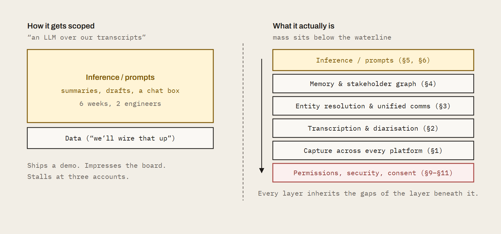
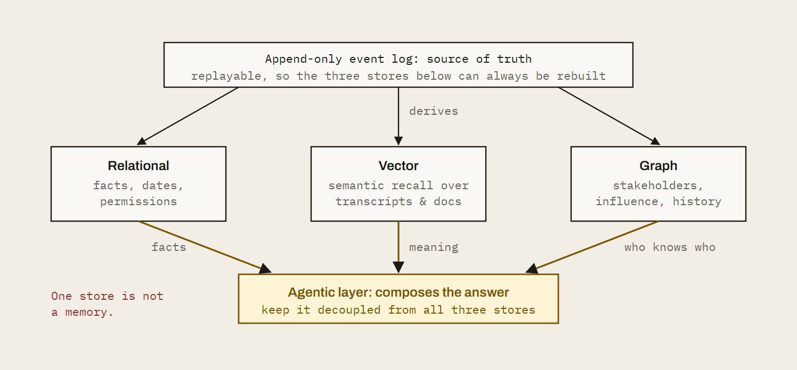

We exist to empower client service and delivery professionals everywhere. That mission is bigger than our product. So if you have looked at Kaizan and concluded you would rather build it yourself: **good. Go and build it.** Here is the whole thing: fourteen systems, the order to build them in, and the failure mode of each one. No sales gate, no redactions. We would rather you succeeded with your own engine than bought ours for the wrong reasons.

This is written for the head of AI who has just been asked "can we build this?" It is the scope, the sequencing and the traps, in the order you will hit them. Where it helps, we name tools and suppliers. Treat those as a starting list, not a recommendation. The market moves monthly.

## What you are signing up for

| | Estimate | What it means |
|---|---|---|
| **Scope** | 14 systems | Not fourteen features. Fourteen systems, each with its own on-call rota. |
| **Time to parity** | 18–24 months | To something an account lead trusts without checking the transcript. |
| **Team** | 8–12 people | Backend, data, ML, applied research, plus a compliance owner who is not a volunteer. |
| **Hardest part** | Evaluation | Not inference. Inference is the easy half and the half everyone scopes. |
| **Ongoing cost** | Permanent | Platforms change without notice. Nothing here is ever "done". |
| **Difficulty** | Expert | Two of the fourteen, consent and permissions, are legal problems wearing engineering clothes. |

Figures are our estimate for a mid-sized professional services firm reaching production across a full client portfolio, based on how long each layer took us. Your mileage will vary with how much of the stack you buy. We have published the estimate rather than hidden it, because the number is the useful part.

## Before the list

**Client intelligence is not a summarisation feature. It is a data platform with an inference layer on top.**

Most internal builds fail because they start at the inference layer and discover the data problem six months in. By then the demo has been shown to the board and the budget is committed to the wrong shape of work. Start with the data.

*Fig. 1: The scoping error. The two stacks contain the same feature. The difference is everything under it. Teams that scope the left-hand picture discover the right-hand one at month six, with the timeline already public.*

## The build, in order

*Fig. 2: Dependency order. The pipeline is mostly serial, which is the part that resists being parallelised across a big team. You cannot buy your way to month twelve by adding engineers at month three. Stage one is every channel and tool, not just calls: transcripts, email threads, chat and the CRM, project and ticketing tools around them, resolved onto one client timeline. Transcripts alone is an LLM over recordings, which your people can already do today.*

**Phase I: Get the data**

- **01** Capture. Calls, threads, chat and tools across every channel
- **02** Transcription that survives a real client call
- **03** Unified client comms. No manual assignment, no duplicates

**Phase II: Make it mean something**

- **04** One brain. Persistent memory and stakeholder context
- **05** Multi-LLM routing for the task at hand
- **06** Accuracy. Prompts vs an agentic system that learns

**Phase III: Make it useful**

- **07** Proactive helpers, not chat windows
- **08** Cross-network recommendations

**Phase IV: Make it allowed**

- **09** Permissions and access rights by client, tier and user
- **10** Security
- **11** Microsoft and Google permissions at machine level

**Phase V: Make it count**

- **12** Integrations with field-level mapping and decisioning
- **13** API management and endpoint development
- **14** Proving it worked

**The team:** the people this takes, and the people who have done it.

## Phase I: Get the data

Three systems, and the only three that every later system depends on. Stage one is every channel and tool your people and clients live in: transcripts, threads, chats and tool data, captured and unified together. Build these badly and everything above them is confidently wrong.

### 01. Capture. Calls, threads, chat and tools across every channel

**What you are building.** Capture of every channel your people and your clients actually live in, not just calls. Meetings: a system that knows which ones matter, gets a recorder into them across Teams, Google Meet and Zoom, and recovers when it doesn't. Written comms: email threads and chat, pulled in at the same time and from the same day. Tools: the CRM, project, ticketing and support systems where client work is actually recorded, connected through OAuth-managed integrations rather than one-off scrapers.

**Why all of it at stage one.** Transcripts alone only reproduce what anyone can already do by pasting a recording into an LLM. The intelligence is in the join: what was promised on the call, what was said in the thread afterwards, what the client posted in chat that never reached a meeting, and what the CRM or ticket says happened. Build for transcripts, threads, chats and tool data together at the start, because every later system (memory, helpers, proof) inherits whatever this layer leaves out.

#### How to approach it

- **Calendar first.** Subscribe to change notifications, such as Microsoft Graph subscriptions or Google Calendar push channels, rather than polling. Handle recurring series expansion, moved instances and external organisers as first-class cases, not edge cases.
- **Build a join-policy engine.** Internal vs external attendees, client domain matching, per-client and per-user consent flags, opt-out lists. This is a rules service, not an if statement.
- **Treat tool integrations as capture, not a later add-on.** Client context lives in CRM, project, ticketing and support tools as much as in calls. Every connector brings its own auth flow, token refresh, rate limits and schema quirks, and the long tail is where the time goes: a handful of connectors is a project, hundreds is a platform.
- **Design for team mode from day one.** One meeting, one recording, shared to everyone with access. If three people from your firm attend, one bot joins, not three. Retrofitting this is a data migration.
- **Decide early whether to build or buy the bot layer.** Building means maintaining headless browser or native SDK clients per platform. Buying means a per-minute cost and a dependency. Wrap it behind your own interface either way so you can swap.
- **Instrument capture failures as alerts to the account lead**, not as log lines. Nobody reads the log lines.

#### Options

- *Bot layer:* Recall.ai or similar meeting-bot APIs
- *Own it:* platform-native SDKs for Zoom, Teams and Meet

#### Watch out for

Waiting rooms, admission prompts, tenant policies that block third-party bots, and platform changes that arrive without notice. Budget permanent engineering time here. This layer is never finished.

#### If you get it wrong

You get a partial view. One platform is covered and the client who insists on Teams is invisible. Single-player recording produces three copies of the same meeting, each summarised differently, each counted as a separate interaction in the health score.

Missed captures go unnoticed until the account lead asks why last week's escalation isn't in the record. Every layer above this one inherits the gaps.

### 02. Transcription that survives a real client call

**What you are building.** Accurate, speaker-attributed text with client vocabulary spelled correctly and the right words attributed to the right people.

#### How to approach it

- **Separate speech-to-text from diarisation.** Evaluate them independently on your own calls, not vendor samples. Word error rate on a clean podcast tells you nothing about a nine-person review with two dial-ins.
- **Resolve speakers to identities, not labels.** "Speaker 2" is useless. Match voices to calendar attendees, join names and prior voiceprints so the transcript says who actually spoke.
- **Build per-client custom vocabularies** from CRM data, email signatures and document names, and refresh them automatically. Brand names, campaign names and acronyms are where trust is lost.
- **Run redaction before storage.** PII, payment details and anything your DPA says shouldn't persist.
- **Store timestamps at utterance level.** Everything downstream, citations, clips, the audit trail, depends on it, and adding it later means reprocessing your whole archive.

#### Options

- *Speech-to-text:* Deepgram, AssemblyAI, self-hosted Whisper variants
- *Diarisation:* pyannote, or vendor-native speaker separation
- *Method:* test all of them on your worst audio, not your best

#### Watch out for

Accents, crosstalk, dial-ins and mixed-language calls. These are not rare. They are most of your calls with your largest clients.

#### If you get it wrong

Misattribution. The client's frustration gets pinned on the wrong speaker, or the wrong target. A client venting about another supplier reads as a client venting about you, and the health score drops on a relationship that is fine.

An action item lands on the wrong person and nobody does it. And once an account lead sees one of these, they stop trusting all of it, including the parts that were right.

### 03. Unified client comms. No manual assignment, no duplicates

**What you are building.** One timeline per client with emails, calls, chats and tool activity attached to the right client and the right stakeholder, without anyone tagging anything. This is where the channels captured in §1 and §2 become one picture rather than three silos.

#### How to approach it

- **Entity resolution is the core problem.** Build a canonical person and organisation model with a deterministic matching layer (domains, addresses, IDs) and a probabilistic layer (name variants, signatures, embedding similarity) behind it.
- **Handle the hard cases explicitly.** Shared parent companies, contacts who move firms, your staff working from client email domains, shared inboxes and distribution lists. Each one is its own rule.
- **Deduplicate at ingestion.** Threads, forwards and CC sprawl mean the same content arrives many times. Hash on normalised content, not message IDs.
- **Build a coverage monitor.** Which clients have no activity in the data for fourteen days, and is that because the relationship went quiet, or because ingestion did?

*Fig. 3: Entity resolution. The deterministic layer is a weekend. The probabilistic layer and the four hard cases are the quarter. The review queue is the honest measure of how well the two layers above it are doing.*

#### Watch out for

The temptation to let users assign records manually. The moment you do, coverage drops and the intelligence layer is reasoning on a partial picture, while reporting as though it isn't.

#### If you get it wrong

Two clients under one parent company merge into a single blurred record. A contact who moved firms carries their old client's history into the new one. Duplicated threads inflate activity scores, so a neglected client looks healthy.

Manual tagging means the busiest account leads, who have the most at-risk clients, are the ones with the least data. The engine ends up describing your team's filing habits rather than the relationship.

## Phase II: Make it mean something

The data exists. Now it has to become institutional memory that survives people leaving, and outputs somebody will act on without checking the transcript.

### 04. One brain. Persistent memory and stakeholder context

**What you are building.** Institutional memory. Not a store of summaries, but a model of each client relationship that persists across people and time.

#### How to approach it

- **Model the stakeholder graph.** Person, role, influence, sentiment over time, open commitments, history of asks. Make relationships between people first-class objects, not attributes hanging off a contact record.
- **Attribute sentiment to its target.** "Annoyed" is not a fact until you know annoyed at whom, about what. Store the object of every sentiment and commitment, not just the polarity.
- **Extract client objectives** from documents and conversations and keep them current. Every downstream output should be measurable against them. This is the single most important design decision in the system.
- **Choose your storage deliberately.** You need at least three shapes: relational for facts, dates and permissions; vector for semantic retrieval; graph for stakeholders and influence. Some teams add an append-only event log as the source of truth and derive the other three from it. That is the cleanest pattern if you can afford the engineering.
- **Put the agentic layer across all of it.** Agents query structured data for facts, vectors for meaning and the graph for who-knows-who, then compose the answer. Do not let a single vector store be the memory.
- **Handle contradictions.** Two sources disagreeing about a fact needs a resolution rule and a record of what you decided.

*Fig. 4: Three shapes, one brain. The common shortcut is to treat the vector store as the memory. It answers "what was said recently" well and "what was promised in March" not at all, which is the question that actually loses accounts.*

#### Options

- *Start here:* Postgres with pgvector covers relational and vector for most teams
- *Graph / temporal:* Neo4j, or a memory layer like Zep, Graphiti or Mem0
- *Orchestration:* LangGraph, the Anthropic or OpenAI agent SDKs, or your own

#### Watch out for

Context windows. Eighteen months of a large client will not fit. You need summarisation hierarchies and memory consolidation, and they need to be lossless on commitments: a consolidation step that drops a promise is worse than no consolidation at all.

#### If you get it wrong

The system remembers what happened on Tuesday and forgets what was promised in March. A new account lead inherits a client with no usable history. Sentiment without a target produces alerts nobody can act on.

Retrieval returns the most recent conversation rather than the relevant one, and recommendations are made against objectives the client stopped caring about two quarters ago.

### 05. Multi-LLM routing for the task at hand

**What you are building.** A model layer that picks the right model for extraction, classification, reasoning and drafting, and keeps working when a provider changes.

#### How to approach it

- **Put a routing layer between your application and every model provider.** Task type, latency budget, cost ceiling and data-residency rules decide the model.
- **Build evaluation harnesses per task before you pick models.** Golden datasets from your own data, scored on the dimensions that matter to an account lead. Let the evals choose, not the engineer with the strongest opinion.
- **Pin prompt and model versions** and run regression suites on every change. Providers update behaviour silently, and you will not be told.
- **Track cost per client per task.** Portfolio economics look nothing like a ten-account pilot.

#### Options

- *Routing:* LiteLLM, Portkey or OpenRouter
- *Or:* a thin internal gateway, if you want the control and the on-call

#### Watch out for

Letting one engineer's preferred model become the default for everything. Extraction, tone and reasoning have different winners, and the gap between them is large enough to be visible to clients.

#### If you get it wrong

A provider outage takes down every feature at once. A silent model update changes the tone of every client email overnight and nobody knows why until a client replies.

Costs scale linearly with clients because everything runs on the most expensive model. Extraction quality is mediocre because the model chosen for drafting is doing the extraction.

### 06. Accuracy. Prompts vs an agentic system that learns

**What you are building.** Outputs an account lead will act on without checking the transcript. And a definition of "great" the system can be measured against. **This is the section most teams skip, and the one that decides whether the other thirteen were worth building.**

#### How to approach it

- **Decompose.** Extraction, verification, synthesis and drafting as separate steps with checks between them. A single prompt over a transcript produces plausible. Plausible is what gets you switched off.
- **Cite everything.** Every claim points at a source utterance or document line. Confidence scores are not citations.
- **Build the eval system.** Get your best practitioners to label what a great follow-up email, a correct risk flag and a complete action list actually look like, across hundreds of real examples. Turn that into golden datasets per task, with rubrics. Score every prompt and model change against them before it ships.
- **Budget honestly for it.** Weeks of senior people's time, and the datasets need refreshing as your work changes. This is the expensive part. There is no tool that does the labelling for you.
- **Capture feedback as data.** Edits, dismissals, acceptances and thumbs-down are labelled training signal. Store them against the prompt version and model that produced the output.
- **Close the loop.** Use preference data to tune prompts, rerankers or fine-tunes on a schedule. Then measure whether quality improved on the evals, not just whether acceptance went up.

*Fig. 5: The gate is the product. Without it you are shipping prompt changes on vibes and finding out from users. The loop is unglamorous, it never appears in a demo, and it is the difference between a system people trust and a system people quietly stop opening.*

#### Options

- *Eval infrastructure:* Braintrust, LangSmith, promptfoo, Arize
- *The labelling:* yours to do; no tool does it for you

#### Watch out for

Optimising for acceptance rate alone. Users accept flattering outputs. Tie learning to outcomes on the relationship, not to clicks.

#### If you get it wrong

You ship changes blind. A prompt tweak that improves one output type degrades another and you find out from users. Hallucinated commitments make it into client-facing emails.

Without a shared definition of great, every account lead judges the system by their own standard and the loudest opinion wins. Adoption plateaus at the people who like it and never reaches the people who need it.

## Phase III: Make it useful

A system that is accurate and unused has failed. This phase is about reaching people where they already work, and being honest about the one capability you cannot build alone.

### 07. Proactive helpers, not chat windows

**What you are building.** Agents that tell the account lead what they didn't know to ask, at the moment it is useful.

#### How to approach it

- **Define the signals.** Renewal risk is a sequence, not a single event. Encode patterns as detectors over the timeline with explicit thresholds you can tune.
- **Know who each user is.** Role, seniority, and the clients and product or service lines they own. Cross-company alerts go to the people who can act on them: an issue pattern on one product or service line routes to that line's leadership, not to everyone. Source roles from your directory or HR system and keep them in step with reorganisations, or the routing quietly rots.
- **Give each user a memory.** What they have seen, what they acted on, what they ignore. Suppress what they have dismissed before.
- **Build collective intelligence within your own data.** What worked on one client informs the play on the next. This requires an action taxonomy and an outcome record (see §14).
- **Deliver into existing tools.** Slack, Teams, email, CRM. A dashboard people have to visit is a dashboard people don't visit.

#### Watch out for

Alert fatigue. The first version will over-fire; every first version does. Design the tuning loop before launch, not after the channel gets muted. Broadcasting a company-wide issue to everyone is the fastest route to a muted channel: role-aware routing is a launch requirement, not a refinement.

#### If you get it wrong

The system answers questions nobody asked and stays silent on the ones that mattered. Alerts fire on noise, people mute the channel, and the one genuine risk flag goes unread.

Every user gets the same output regardless of role, so the account director and the junior exec both ignore it for different reasons. You have built a search box over transcripts and called it intelligence.

### 08. Cross-network recommendations

**What you are building.** Benchmarks and recommendations informed by more relationships than your firm has.

#### How to approach it

- **Honestly, you can't.** Your data is your data. A benchmark against your own portfolio is useful, but it is a sample of one firm's way of working. We are not going to pretend otherwise in a document whose whole point is to tell you the truth.
- **If you want cross-firm intelligence**, you need a partner with a network and a privacy architecture that separates anonymised patterns from identifiable client data. Build the interface for it even if you don't have the data yet, so the seam is in the right place when you do.

#### Watch out for

Assuming your own historical data is enough to learn what works. It tells you what your firm did, not what the market does, and those diverge most sharply in exactly the accounts you are worried about.

#### If you get it wrong

Your health scores have no external reference. A client at 70 might be your best relationship or the industry's worst, and nothing in your data can tell you which.

Recommendations are limited to plays your firm has already tried, so the system reinforces existing habits rather than improving them.

## Phase IV: Make it allowed

Three systems that produce no visible features and can each end the programme on their own. Two of them are legal problems in engineering clothes. All three are cheaper to design in than to retrofit.

### 09. Permissions and access rights by client, tier and user

**What you are building.** Need-to-know, enforced at the data layer.

#### How to approach it

- **Enforce access in the database, not the application.** Row-level security or an equivalent policy layer keyed on client, team and user. Application-layer checks are one forgotten endpoint away from a breach.
- **Model tiers.** Which clients get which capabilities. Which users see portfolio views, which see only their own accounts.
- **Support client opt-outs cleanly.** One client refuses recording. The system degrades for that client and nowhere else.
- **Log every read.** Who saw what and when, queryable for a client audit. You will be asked.

*Fig. 6: One edge, moved. The leaking version passes every functional test: the answer is correct and the user is authenticated. Nothing fails until someone reads an answer citing a client they have never worked on.*

#### Watch out for

Retrieval leaking across boundaries. A vector search across all clients returns chunks from clients the user shouldn't see unless the filter is applied *before* the search, and post-filtering still means the content reached the model.

#### If you get it wrong

A junior on one account sees the commercials of another. A client's confidential conversation surfaces in an answer for a competitor client served by the same team.

One leak of this kind ends the programme, and possibly the client relationship, and you will hear about it from the client's legal team rather than your own.

### 10. Security

**What you are building.** The controls that let a client's IT team say yes.

#### How to approach it

- **Start the SOC 2 process before you have users**, not after. Controls are far cheaper to design in than to retrofit, and the audit period is a calendar constraint you cannot compress.
- **Encryption at rest and in transit**, managed keys, secrets rotation and scheduled penetration testing.
- **Retention and deletion that reach everywhere.** Databases, object storage, vector indices, model provider logs and backups. The vector index is the one everyone forgets.
- **Sub-processor agreements** with every model provider, and a clear answer on where inference runs.

#### Options

- *Compliance programme:* Vanta or Drata
- *Penetration testing:* a named external firm, on a schedule

#### Watch out for

Model provider defaults. Check data retention and training clauses on every API you call, and pin them contractually. The default terms are rarely the terms you assumed.

#### If you get it wrong

Procurement blocks the rollout at your biggest client. A deletion request can't be honoured because transcript chunks live in a vector index nobody thought about.

A model provider retains client conversations for training under default terms, and you have breached your own client contracts without knowing it.

### 11. Microsoft and Google permissions at machine level

**What you are building.** The consent, scopes and verification needed to access calendars, mail and meetings inside your clients' tenants.

#### How to approach it

- **Request minimum scopes.** Admin-consented application permissions for Graph, domain-wide delegation or per-user OAuth for Workspace. Document why you need each one, because you will be asked to justify them line by line.
- **Complete publisher verification and app attestation.** Client IT teams will ask who your app is.
- **Handle recording and microphone consent per jurisdiction.** Announce, log and respect refusals.
- **Build for revocation.** Token refresh failures, scope changes and conditional access policies break silently. Design the alerting for it now.

#### Watch out for

Assuming your own tenant's settings match your clients'. Every enterprise tenant is configured differently, and you will discover each variation in production.

#### If you get it wrong

Your bot is blocked from half your client meetings by a tenant policy you didn't know existed. Over-broad scopes fail a client's security review and you are asked to re-architect.

A token expires quietly and three weeks of a key client's calendar goes uncaptured. Recording without proper consent in the wrong jurisdiction is a legal problem, not a product one.

## Phase V: Make it count

Getting the intelligence out of one application and into the ecosystem you are actually building, and being able to answer the board's only question.

### 12. Integrations with field-level mapping and decisioning

**What you are building.** Two-way sync with CRM, project and ticketing tools that keeps systems consistent.

#### How to approach it

- **Map at field level, per client and per user.** Which source wins for each field, and under what conditions.
- **Separate automatic write-backs from human-approved ones.** Default to approval for anything client-visible.
- **Version your mappings.** Schema changes in the downstream tool shouldn't silently corrupt your data.
- **Plan for rate limits and deprecations.** Every integration is an on-call responsibility, permanently.

#### Options

- *Unified integration layers:* Merge, Nango, Composio or Paragon, if you'd rather not maintain each connector

#### Watch out for

Treating a webhook to the CRM as an integration. Delivery is the easy part. Consistency is the hard part, and it is the part that gets you trusted.

#### If you get it wrong

The CRM and the intelligence layer disagree about the renewal date and nobody knows which is right. An automatic write-back overwrites a field a salesperson corrected by hand.

A downstream schema change breaks sync silently and the CRM is a month stale before anyone notices.

### 13. API management and endpoint development

**What you are building.** The interface your proprietary AI ecosystem consumes.

#### How to approach it

- **Design the API before the UI.** If the goal is intelligence flowing into your own systems, the endpoints are the product and the interface is a client of them.
- **Version from day one.** Authentication, rate limiting, usage metering and documentation as standard.
- **Publish events.** Webhooks or streams, so internal systems react to signals rather than poll.
- **Expose an MCP server** so your internal agents can query client context directly rather than through bespoke glue.

#### Watch out for

Schema churn. The team building on top of you will stop if they are rebuilding every quarter.

#### If you get it wrong

The intelligence is trapped in one application. Every internal team that wants it builds their own scraper or export. Breaking changes ship without versioning and downstream systems fail on a Monday morning.

The "AI ecosystem" you set out to feed never gets fed.

### 14. Proving it worked

**What you are building.** The evidence that the system moved revenue.

#### How to approach it

- **Define an action taxonomy.** What the system recommends, in a fixed vocabulary.
- **Keep a decision ledger.** Every recommendation, whether it was acted on, and what happened to the relationship afterwards.
- **Measure outcomes on renewals, expansion and churn avoided.** Separate what the system did from what the team would have done anyway. This is the hard and necessary part.
- **Re-benchmark continuously**, so a score in June means what it meant in January.

#### Watch out for

Skipping this because it isn't a feature. It is the answer to the board's only question, and you cannot reconstruct it retrospectively.

#### If you get it wrong

Twelve months in, you can't say whether it worked. Anecdotes stand in for evidence.

The budget conversation becomes a matter of opinion, and the project is judged on how much people like it rather than on what it did for the client portfolio.

## The people this takes, and the people who have done it

**Fourteen systems need eight disciplines that rarely sit in one team.**

Which model you call is one box of fourteen (§5), and the easiest one to swap. The rest is a scaled-systems problem, a data problem, an evaluation problem and two legal problems. That is a hiring plan, not a prompt.

| Covers | Discipline | What it involves |
|---|---|---|
| §1–3 | **Data platform and ingestion** | Real-time capture across Teams, Meet and Zoom, email and chat. Entity resolution and deduplication at volume. Platform APIs that change without notice. |
| §2, 4 | **Speech and retrieval** | Diarisation, vocabulary tuning, vector, relational and graph stores. People who have run search and memory systems in production. |
| §5–6, 8 | **Applied ML and evaluation** | Model routing, golden sets, rubrics, regression gates. The scarcest skill on the list and the one most teams skip. |
| §7 | **Product and agent engineering** | Detectors, role-aware routing, delivery into Slack, Teams, email and CRM. Alert tuning loops. |
| §9, 11 | **Permissions and consent** | Row-level access by client, tier and user. Microsoft and Google consent, publisher verification, tenant scopes. Legal problems in engineering clothes. |
| §10 | **Security and compliance** | A named owner, not a volunteer. Certification, data residency, model-provider terms, client IT reviews. |
| §1, 12–13 | **Integrations and API** | Hundreds of tool connectors with auth, rate limits and schema drift. Field-level CRM and PSA mapping, versioned APIs, schema discipline downstream teams can build on. |
| §14 | **Analytics and outcomes** | Attribution, counterfactuals, proof that a recommendation moved revenue or retention. |

### What an agency has to hire

8–12 specialists across the eight disciplines above, in a market where engineers who have shipped evaluation and permissions at scale are scarce and expensive. The team has to be in place before month three, because the pipeline is serial and cannot be sped up by adding people later.

### What Kaizan already has

A team that has built and run large-scale systems at companies such as Meta, and has already been through each of the fourteen failure modes in this guide. Tool capture is already running at breadth: nearly 1,000 tools supported through Nango and Composio, so a new client's stack is connected rather than custom-built. That experience is the difference between a build that reaches parity in 18–24 months and one that discovers the right-hand picture at month six.

## How this usually goes when it goes wrong

Almost nobody fails at this in month three. The demo works in month three. That is the problem. Internal builds die slowly, in a pattern consistent enough to be worth writing down. If you recognise your own programme in the middle of this list, you still have time.

**Month 3: The demo lands.** A prompt over a transcript produces a genuinely impressive summary. It is shown to the board. A date gets committed to. The data work has not started, and nobody in the room knows that yet.

**Month 6: The data problem arrives.** Coverage is at 40%. Teams meetings aren't captured, two clients share a parent company and have merged into one record, and the health scores are visibly wrong to the people who know those accounts. Engineering effort silently re-routes from features to plumbing.

**Month 9: Trust goes before coverage does.** An account lead is shown a risk flag built on a misattributed sentence. They mention it to two colleagues. Usage among senior people, the ones with the at-risk accounts, stops recovering, and the usage chart stays flat while the team keeps shipping.

**Month 12: The security review.** Your largest client's IT team asks where inference runs, what the model provider retains, and whether a deletion request reaches the vector index. Two of the three answers require work that was never scoped. The rollout pauses.

**Month 14: Everything still runs.** Nothing is on fire. Capture drifts as platforms change, a token expires quietly, prompts get tuned on opinion because the eval set was never built. The system degrades at a rate slower than anyone's attention span.

**Month 18: The budget question.** Someone asks what it delivered. There is no decision ledger, so the answer is anecdotes. The programme isn't cancelled. It is reduced to the one feature people liked, maintained by one engineer, and quietly stops being called a platform.

Every step in that sequence traces back to a decision in the first three sections of this document. That is why the order matters more than the technology choices, and why we put the boring layers first.

## Conclusion

> Your advantage is not a diarisation pipeline or a consent flow. It is what your people do with the truth about the client portfolio once they have it.

So here is the honest version, and it is the reason we published this rather than a comparison page.

**If client intelligence is your product, build all fourteen.** Genuinely. You have the domain knowledge, you have the data, and there is no moat in this document that a serious team can't cross. It will take longer than your plan says, the eval work will be the part that surprises you, and the two layers that end programmes are the two with no visible features. But it is a build, not a miracle. Take this list, argue with it, sequence it, and go.

**If it isn't your product, don't.** Take it through an API, feed it into the ecosystem you are already building, and put your head of AI on the problems only your firm can solve. The fourteen systems above are table stakes for us and a two-year detour for you. Nobody has ever won a client because their diarisation was excellent.

Either way, the layer that is genuinely yours (your judgement about your clients, encoded) is the one worth your best engineers. Build that one.

### You're building it

Take the list. If you want a second opinion on sequencing, what to buy versus build, or the eval design that most teams get wrong, we will give you an hour with no pitch attached. We would rather the industry had more of these built well. [Talk it through →](https://kaizan.ai/demo/)

### You'd rather plug it in

All fourteen, running today, with an app and an API. Your data stays yours, the intelligence flows into the systems you already have, and your team gets the months back. [See Kaizan →](https://kaizan.ai/product/)

Reach out if you want help thinking about any of this, or just plug Kaizan in and use our app and API. Both are a fine outcome from our side.

*Tools named in this guide are a starting list, not a recommendation.*
